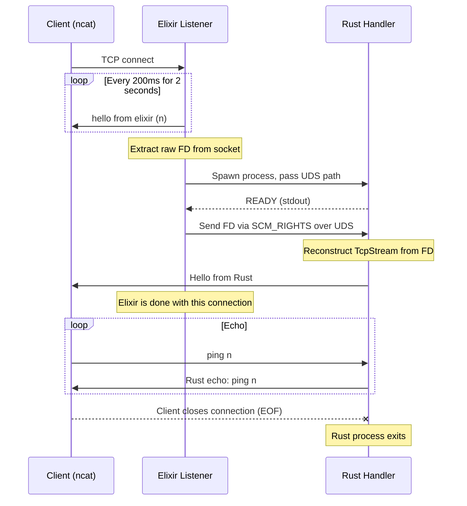
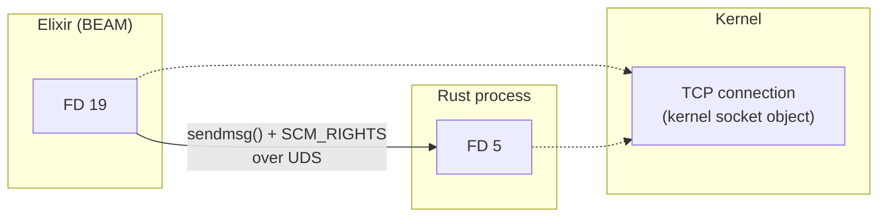

# Hand Off to Rust

An Elixir + Rust demo that hands off a **live TCP socket** from the BEAM to a standalone Rust process — without the client noticing.



> **📖 [Read the full deep-dive: How it works →](docs/how-it-works.md)**
>
> Covers `SCM_RIGHTS`, non-blocking socket gotchas, `CLOEXEC`, why you must *not* call `gen_tcp.close/1` after handoff, and more.

## What happens

1. Elixir accepts a TCP connection and sends `"hello from elixir"` every 200ms for 2 seconds
2. Elixir extracts the raw file descriptor from the socket
3. Elixir spawns a Rust binary and passes the FD via **`SCM_RIGHTS`** over a Unix domain socket
4. Rust reconstructs a `TcpStream` from the FD, sends `"Hello from Rust"`, and echoes everything back
5. When the client closes the connection, the Rust process exits

The client sees **one unbroken TCP connection** that starts speaking Elixir and then switches to Rust.

## Prerequisites

- Elixir ≥ 1.20
- Rust toolchain (cargo)
- [just](https://github.com/casey/just) command runner
- [phx-port](https://github.com/chgeuer/phx-port) for stable port assignment
- Linux (requires Unix domain sockets and `SCM_RIGHTS`)

## Quick start

```bash
# Build everything (Rust handler binary + NIF + Elixir)
just build

# Run the full demo in one terminal
just auto
```

## Usage

```bash
just start          # Start the server as a background BEAM node
just client         # Connect with the Elixir test client (new terminal)
just ncat           # Connect with raw ncat — see both servers on one socket
just stop           # Stop the server
```

The `ncat` recipe is the most fun — you see the Elixir greetings scroll by, then `"Hello from Rust"` appears, and anything you type gets echoed by Rust:

```
$ just ncat
hello from elixir (1)
hello from elixir (2)
...
hello from elixir (10)
Hello from Rust
hey there               ← you type this
Rust echo: hey there    ← Rust responds
```

## All commands

```
just build          Build everything
just start          Start the BEAM node
just stop           Stop the BEAM node
just status         Check if the node is running
just log            Tail the server log
just client         Elixir test client
just ncat           Raw ncat client (proves it's one TCP stream)
just auto           Full automated demo (single terminal)
just rpc '<expr>'   Evaluate Elixir on the live node
just clean          Remove all build artifacts
just demo           Show step-by-step instructions
```

## Project structure

```
hand_off_to_rust/
├── lib/
│   └── hand_off_to_rust/
│       ├── application.ex      OTP app — starts the Listener
│       ├── listener.ex         GenServer: accept → greet → handoff
│       └── fd_sender.ex        Rustler NIF wrapper for send_fd
├── native/
│   └── fd_sender/              Rustler NIF crate (sends FD via SCM_RIGHTS)
│       └── src/lib.rs
├── rust_handler/               Standalone Rust binary
│   └── src/main.rs             Receives FD → greets → echoes → exits on EOF
├── scripts/
│   └── dev_node.sh             BEAM node lifecycle (start/stop/rpc)
├── docs/
│   └── how-it-works.md         Detailed blog-style write-up
├── test_client.exs             Elixir test client
└── justfile                    All the commands
```

## How it works

The key mechanism is **`SCM_RIGHTS`** — a POSIX feature that lets one process send a file descriptor to another over a Unix domain socket. The kernel creates a new FD in the receiver pointing to the same socket object.



1. **Elixir** extracts the raw FD from a `gen_tcp` socket using `:prim_inet.getfd/1`
2. A **Rustler NIF** sends that FD over a UDS using `sendmsg()` with `SCM_RIGHTS`
3. The **Rust binary** receives it with `recvmsg()`, wraps it in a `TcpStream`, and takes over

**📖 [Full deep-dive with code walkthrough and gotchas → `docs/how-it-works.md`](docs/how-it-works.md)**
